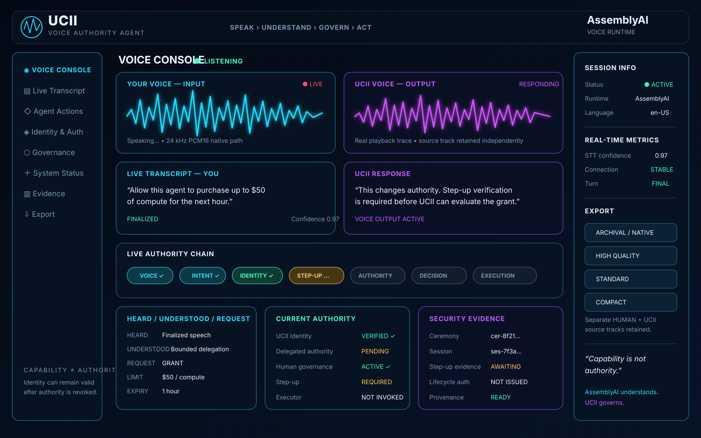

# Voice Authority Proof UI Specification

## Status

**DESIGN CONTRACT — IMPLEMENT ONLY AFTER THE CORE AUTHORITY PATH AND REAL ASSEMBLYAI VOICE PATH ARE ESTABLISHED AND VERIFIED**

## Visual concept

The concept image above is the preferred visual target, but it is not evidence of implemented runtime state. The production UI must render real AssemblyAI and UCII events rather than fabricated dashboard values.

**Nothing that looks operational is merely decorative.** The HUMAN and UCII voice graphs are mandatory real-time audio visualizers driven by their actual independent audio streams. Likewise, transcript state, playback controls, confidence/latency metrics, recording indicators, authority state, countdowns, decisions, execution state, health indicators, and evidence must be backed by real runtime data or clearly report unavailable/unknown.

Detailed interactive and acceptance requirements are frozen in [`proof-ui-functional-requirements.md`](proof-ui-functional-requirements.md). That contract includes real-time dual audio analysis, per-turn playback, waveform/transcript synchronization, conversation history, clarification behavior, device controls, authority countdown, decision history, export/session packages, Demo Mode, system health, and end-to-end functional verification.

### Implementation gate

Do **not** build the polished UI first and retrofit functionality later. Engineering order remains:

1. finish the genuinely required UCII HUMAN lifecycle conversion boundary;
2. leave UCII core;
3. establish and verify the real AssemblyAI microphone/session/finalized-turn/output-audio path;
4. establish bounded structured operation handling;
5. connect the real UCII identity/governance/step-up/authority/execution path;
6. only then implement the visual interface against those real events, retained audio streams, and evidence;
7. verify every interactive control end to end;
8. adversarially verify that no visual state can imply authority or execution the underlying system did not establish.

This document defines the judge-facing and user-facing proof UI for the UCII Voice Authority Agent. The UI renders real AssemblyAI conversation events and real UCII identity, step-up, governance, lifecycle-authorization, delegation, revocation, execution, and provenance state.

Core visual thesis:

> **AssemblyAI hears and understands the human. UCII determines whether what the human asked for is allowed to happen.**

Core security thesis:

> **Understanding a human request does not create authority to execute it.**

The interface makes the separation visible:

`Voice != Intent != Identity != Authentication != Step-Up != Authority != Decision != Execution`

## Functional contracts

The following are required product behaviors, not presentation ideas:

- **YOUR VOICE — INPUT:** actual microphone-driven real-time amplitude/frequency visualization; no canned or looping trace.
- **UCII VOICE — OUTPUT:** actual returned/playback-audio-driven real-time visualization, independently sourced from HUMAN input.
- **Live transcript:** real partial/final AssemblyAI state, with security decisions based only on finalized/bounded input.
- **Per-turn audio playback:** finalized HUMAN and UCII turns expose playback when their real audio was intentionally retained.
- **Synchronized playback:** waveform seek/playhead and transcript synchronization use real timing information where supported; unsupported precision is never fabricated.
- **Conversation history:** prior turns, decisions, and historical evidence remain inspectable without rewriting historical truth.
- **Clarification:** ambiguous consequential requests visibly enter CLARIFICATION REQUIRED/SAY AGAIN rather than silently expanding scope.
- **Authority countdown:** real expiry-derived remaining time; UCII, not the UI timer, remains authoritative.
- **Decision history:** real chronological DENY/GRANT/ALLOW/REVOKE outcomes with non-secret evidence linkage.
- **Identity vs authority:** revocation visibly changes authority while identity remains VERIFIED when still valid.
- **Media controls:** real microphone/speaker/recording state, device selection where supported, input level, mute, and failure handling.
- **Export:** explicit artifact selection plus ARCHIVAL/NATIVE, HIGH QUALITY, STANDARD, and COMPACT profiles against actual implemented formats.
- **Derived two-channel export:** where independent HUMAN and UCII mono sources exist, a HUMAN-left/UCII-right conversation may be offered but is labeled derived, never native AssemblyAI stereo.
- **Complete session package:** selected transcripts, retained audio, safe metadata, and non-secret evidence/provenance can be exported together.
- **Demo Mode:** presentation emphasis only; it uses exactly the same real runtime state and cannot inject outcomes.
- **System health:** AssemblyAI, UCII, microphone, playback, and secure-session indicators reflect measured/known state rather than default green.

## Visual direction

The application should look like a near-future technical control plane rather than a generic SaaS dashboard. Preserve the preferred concept's dark navy/black base, restrained glass panels, cyan HUMAN input, violet/magenta UCII output, central UCII authority visualization, and clear AssemblyAI attribution.

Green is reserved for verified/established/ALLOW states, amber for clarification/step-up/pending states, and red primarily for DENY/REVOKED/failed verification/security failure. High legibility outranks spectacle.

Atmospheric grid/glow/particles may be decorative only when they cannot be mistaken for operational data. Motion that appears to represent audio, security, authority, evidence, metrics, execution, or health must represent real state.

## Dual real-time voice tracers

The two primary waveform/frequency surfaces are non-negotiable functional components.

### HUMAN input

Label: **YOUR VOICE — INPUT**

State progression: `LISTENING -> SPEAKING -> TRANSCRIBING -> FINALIZED`

The graph continuously follows the real microphone stream while capture is active and settles when idle. A real input-level indicator helps confirm that the microphone is working.

### UCII output

Label: **UCII VOICE — OUTPUT**

State progression where supported: `PREPARING -> RESPONDING -> INTERRUPTED -> COMPLETE`

The graph follows the real returned/playback audio and must never mirror or reuse the HUMAN trace.

## Transcript, playback, and conversation history

A prominent **LIVE TRANSCRIPT — YOU** surface shows partial AssemblyAI transcription progressively and visibly transitions to finalized state. Partial text is visually distinct and never used as finalized security evidence.

The **UCII RESPONSE** surface provides readable text for the spoken response.

When real audio is intentionally retained, each finalized HUMAN and UCII turn exposes compact playback controls. The conversation history retains chronological turns with timestamps, duration where known, source/speaker, transcript, audio link, and associated proof state.

Playback should support play/pause and seek, with additional speed and skip controls where useful. Where reliable timing exists, waveform playback position and transcript highlighting are synchronized. Clicking a historical turn restores its associated `HEARD / UNDERSTOOD / REQUEST` and non-secret evidence context without altering current or historical authority.

Finalized transcript entries should also support convenient copy and evidence-inspection actions.

## HEARD / UNDERSTOOD / REQUEST

The interface explicitly distinguishes:

- **HEARD** — finalized human transcript;
- **UNDERSTOOD** — AssemblyAI/application interpretation;
- **REQUEST** — bounded structured operation proposed to the deterministic authority/application layer.

No transcript, confidence score, model interpretation, confirmation, or audio state is rendered as UCII authority.

## Clarification

If a consequential request lacks a required bounded field or contains unresolved security-relevant ambiguity, the UI enters **CLARIFICATION REQUIRED / SAY AGAIN** and identifies the missing/unclear field where safely possible.

Clarification is distinct from ALLOW, DENY, authentication, step-up, and authority.

## Live Authority Chain

The central proof component visualizes:

`VOICE -> INTENT -> IDENTITY -> STEP-UP -> AUTHORITY -> DECISION -> EXECUTION`

Each stage illuminates only from the corresponding real system state. The UI never skips stages merely to make a demonstration faster.

A legitimate GRANT can progress from finalized voice through bounded intent, authenticated HUMAN, required step-up, fresh governance/lifecycle authorization, ALLOW, and protected execution.

An unauthorized but perfectly understood request can simultaneously show VOICE established, INTENT established, IDENTITY established where applicable, AUTHORITY NOT ESTABLISHED, DECISION DENY, and EXECUTION NOT INVOKED.

## Current Authority and decision history

Keep the selected agent's real identity and delegated-authority state visible. When authority is bounded by time, show a live remaining-time countdown derived from the authoritative expiry.

Revocation should create a strong but truthful transition:

`IDENTITY: VERIFIED`

`AUTHORITY: ACTIVE -> REVOKED`

The same identity remains visible after revocation when still cryptographically valid.

A compact chronological decision trail should preserve real outcomes such as:

`DENY -> GRANT -> ALLOW -> REVOKE -> DENY`

Historical outcomes remain immutable and inspectable through their safe evidence references.

## Step-up and security evidence

When consequence policy requires step-up, show a clear pending state such as **STEP-UP REQUIRED** and the enrolled factor type at a safe level. Factor-possession evidence is never labeled authority.

An expandable evidence view may expose safe session, ceremony, identity, governance relationship, step-up evidence, lifecycle authorization, delegated authority, timestamps, bounded scope, decision, execution, and provenance references when genuinely available.

Never display or export challenge plaintext after use, challenge hashes, controller secrets, reusable credentials, wallet secrets, reusable payment proofs, private keys, or protected custody material.

## Media and session controls

Provide compact real controls for microphone and speaker selection where supported, input level, mute/unmute, recording enabled/disabled state, explicit recording indication, clear/reset conversation for demo preparation, end session, evidence detail, and export.

Browser permission failure, unavailable devices, disconnected audio, or unknown state must be visible rather than silently presented as healthy.

Keyboard conveniences may be added for microphone interaction, selected-audio playback, safe cancellation of noncommitted conversational operations, and mute. They never bypass authority or ceremony requirements.

## Export system

Export is a real product feature. The export drawer should let the user intentionally select HUMAN transcript, UCII transcript, combined transcript, HUMAN audio, UCII audio, combined conversation audio, safe evidence/provenance, session metadata, or a complete safe session package.

The highest-quality option preserves the highest genuine native audio quality actually available from the implemented AssemblyAI/browser audio paths. If the source remains 24 kHz mono PCM16, ARCHIVAL/NATIVE preserves that genuine source rather than manufacturing stereo.

Profiles:

- **ARCHIVAL / NATIVE** — genuine highest available native/lossless source quality;
- **HIGH QUALITY** — high-quality compressed convenience export;
- **STANDARD** — balanced quality and size;
- **COMPACT** — smaller-file export.

Where independent HUMAN and UCII sources exist, they remain independently exportable. A combined derived two-channel HUMAN-left/UCII-right presentation is allowed where useful, but is explicitly labeled derived rather than native AssemblyAI stereo.

Exact codecs, bitrates, sample rates, containers, and channel layouts are frozen only after the real audio path is implemented and inspected.

## Demo Mode and health

Demo Mode may enlarge the real authority chain and hide secondary controls for judging, but it uses exactly the same runtime state and cannot inject scripted security outcomes.

A compact health strip should report measured/known state for AssemblyAI connection, UCII control plane, microphone capture, audio playback, and secure application session. Unknown is not green.

## Visual density

Keep the preferred dashboard clean. Use contextual controls, selected-turn details, drawers, and progressive disclosure rather than permanently adding every control to the main canvas.

The five-second hierarchy remains:

> **Speak -> See what was heard -> See what was understood -> See who is acting -> See whether authority exists -> See ALLOW/DENY -> See whether anything actually happened.**

## Acceptance rule

The UI is not complete because it resembles the concept image. It is complete only when the relevant visible features work against real runtime state and pass the detailed acceptance criteria in `proof-ui-functional-requirements.md`.

> **Nothing that looks operational is merely decorative.**

> **Capability is not authority.**
